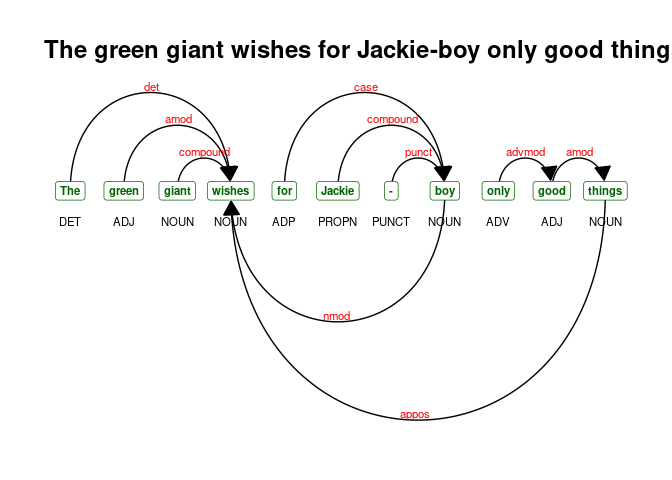

NLP with R: some notes
======================

A summary of some R-based, NLP workflows – mostly using `udpipe`.

------------------------------------------------------------------------

-   [NLP with R: some notes](#nlp-with-r:-some-notes)
    -   [Quick live text](#quick-live-text)
        -   [Online news articles](#online-news-articles)
        -   [PubMed abstracts](#pubmed-abstracts)
        -   [Tweets](#tweets)
    -   [Processing](#processing)
        -   [Sentence tokenization](#sentence-tokenization)
        -   [Tokenization](#tokenization)
        -   [Tokens to data frame](#tokens-to-data-frame)
        -   [Sentences containing X](#sentences-containing-x)
        -   [Annotation](#annotation)
    -   [Multi-word expressions](#multi-word-expressions)
        -   [Collocations](#collocations)
        -   [Noun phrases](#noun-phrases)
        -   [Tokenizing multi-word
            expressions](#tokenizing-multi-word-expressions)
        -   [Annotation to DTM](#annotation-to-dtm)
        -   [Rebuilding text](#rebuilding-text)
    -   [doc2vec](#doc2vec)
    -   [Search](#search)
        -   [Search in context](#search-in-context)
        -   [More complex patterns](#more-complex-patterns)
    -   [Odds](#odds)
        -   [Visualizing dependencies](#visualizing-dependencies)

Quick live text
---------------

### Online news articles

``` r
library(tidyverse)
meta <- quicknews::qnews_get_newsmeta('joe biden')
news <- quicknews::qnews_extract_article(url = meta$link[1:20],
                                         cores = 7)

strwrap(news$text[10], width = 60)[1:5]
```

    ## [1] "WASHINGTON (AP) — Despite a rocky week of fits and starts," 
    ## [2] "President Joe Biden on Friday praised the Senate for edging"
    ## [3] "the bipartisan infrastructure plan closer to passage, ahead"
    ## [4] "of a key vote on the $1 trillion package. As Biden spoke"   
    ## [5] "from the White House, he compared the “historic investment”"

### PubMed abstracts

``` r
s0 <- PubmedMTK::pmtk_search_pubmed(search_term = 'medical marijuana', 
                                    fields = c('TIAB','MH'))
```

    ## [1] "medical marijuana[TIAB] OR medical marijuana[MH]: 2206 records"

``` r
s1 <- PubmedMTK::pmtk_get_records2(pmids = s0$pmid[1:10], 
                                   cores = 3 #, 
                                   #ncbi_key = key
                                   )

strwrap(s1[[1]]$abstract, width = 60)[1:10]
```

    ##  [1] "People living with HIV (PLWH) experience higher rates of"   
    ##  [2] "comorbid chronic pain conditions compared to the general"   
    ##  [3] "population. Managing HIV and chronic pain, two stigmatized" 
    ##  [4] "health conditions, can exacerbate physical and"             
    ##  [5] "psychological suffering. The current qualitative study was" 
    ##  [6] "designed to increase our understanding of the experience of"
    ##  [7] "living with HIV and chronic pain. Twenty participants were" 
    ##  [8] "recruited from a hospital-based immunology center to"       
    ##  [9] "participate in individual in-depth qualitative interviews." 
    ## [10] "The interviews focused on the experience of living with (or"

### Tweets

``` r
tsearch <- rtweet::search_tweets(q = '#Jan6',
                                 n = 100,
                                 type = "recent",
                                 include_rts = FALSE,
                                 geocode = NULL,
                                 max_id = NULL,
                                 parse = TRUE,
                                 token = NULL)

strwrap(tsearch$text[1], width = 60)
```

    ## [1] "@SeditionHunters Ugh. 1. This is the direct result of #DOJ"
    ## [2] "and judges not taking insurrectionists seriously and"      
    ## [3] "locking them up until trial to secure public safety. Weak" 
    ## [4] "release permissions continue to be the theme of #Jan6"     
    ## [5] "cases."

Processing
----------

### Sentence tokenization

``` r
sentences <- PubmedMTK::pmtk_toke_sentences(text = news$text,
                                            doc_id = 1:nrow(news))

sentences %>% head() %>% knitr::kable()
```

<table>
<colgroup>
<col style="width: 2%" />
<col style="width: 97%" />
</colgroup>
<thead>
<tr class="header">
<th style="text-align: left;">doc_id</th>
<th style="text-align: left;">text</th>
</tr>
</thead>
<tbody>
<tr class="odd">
<td style="text-align: left;">1.1</td>
<td style="text-align: left;">Nine months after the election he comprehensively lost, the spectre of Donald Trump – darkly menacing, subversive and apparently immune from prosecution – continues to cast a shadow over US democracy and America’s global standing, distorting policy and poisoning political life.</td>
</tr>
<tr class="even">
<td style="text-align: left;">1.2</td>
<td style="text-align: left;">How can this be?</td>
</tr>
<tr class="odd">
<td style="text-align: left;">1.3</td>
<td style="text-align: left;">Why is this horror movie still running?</td>
</tr>
<tr class="even">
<td style="text-align: left;">1.4</td>
<td style="text-align: left;">Trumpism, like other fascist variants, is a disease, a blight – a noxious far-right populist-nationalist miasma that taints and rots all it touches.</td>
</tr>
<tr class="odd">
<td style="text-align: left;">1.5</td>
<td style="text-align: left;">Older Europeans share a folk memory of fascism.</td>
</tr>
<tr class="even">
<td style="text-align: left;">1.6</td>
<td style="text-align: left;">But too many Americans just don’t get it.</td>
</tr>
</tbody>
</table>

### Tokenization

The order here is wrong; we want to identify sentences, then tokenize –

``` r
a1 <- corpus::text_tokens(sentences$text,
                          
  filter = corpus::text_filter(
    map_case = FALSE, 
    map_quote = TRUE,
    remove_ignorable = TRUE,
    combine = c(corpus::abbreviations_en),
    stemmer = NULL,
    stem_dropped = FALSE,
    stem_except = NULL,
    drop_letter = FALSE,
    drop_number = FALSE,
    drop_punct = FALSE,
    drop_symbol = FALSE,
    drop = NULL,
    drop_except = NULL,
    connector = '_',
    sent_crlf = FALSE)
  )

names(a1) <-sentences$doc_id
a1[[1]]
```

    ##  [1] "Nine"            "months"          "after"           "the"            
    ##  [5] "election"        "he"              "comprehensively" "lost"           
    ##  [9] ","               "the"             "spectre"         "of"             
    ## [13] "Donald"          "Trump"           "–"               "darkly"         
    ## [17] "menacing"        ","               "subversive"      "and"            
    ## [21] "apparently"      "immune"          "from"            "prosecution"    
    ## [25] "–"               "continues"       "to"              "cast"           
    ## [29] "a"               "shadow"          "over"            "US"             
    ## [33] "democracy"       "and"             "America's"       "global"         
    ## [37] "standing"        ","               "distorting"      "policy"         
    ## [41] "and"             "poisoning"       "political"       "life"           
    ## [45] "."

### Tokens to data frame

``` r
a2 <- PubmedMTK::pmtk_cast_tokens(a1)
a2 %>%  slice(1:10)
```

    ##     doc_id sentence_id token_id           token
    ##  1:      1           1        1            Nine
    ##  2:      1           1        2          months
    ##  3:      1           1        3           after
    ##  4:      1           1        4             the
    ##  5:      1           1        5        election
    ##  6:      1           1        6              he
    ##  7:      1           1        7 comprehensively
    ##  8:      1           1        8            lost
    ##  9:      1           1        9               ,
    ## 10:      1           1       10             the

### Sentences containing X

``` r
jrb_sentences <- a2[, if(any(token == 'Biden')) .SD, by = list(doc_id,sentence_id)]
jrb_sentences0 <- jrb_sentences[, list(text = paste(token, collapse = " ")), by = list(doc_id,sentence_id)]

jrb_sentences0 %>% head() %>% knitr::kable()
```

<table>
<colgroup>
<col style="width: 2%" />
<col style="width: 4%" />
<col style="width: 93%" />
</colgroup>
<thead>
<tr class="header">
<th style="text-align: left;">doc_id</th>
<th style="text-align: left;">sentence_id</th>
<th style="text-align: left;">text</th>
</tr>
</thead>
<tbody>
<tr class="odd">
<td style="text-align: left;">1</td>
<td style="text-align: left;">8</td>
<td style="text-align: left;">By refusing to confront his crooked predecessor and bring him to justice , Joe Biden feeds delusional Trump’s sense of godlike impunity , and the dread prospect of a blasphemous second coming .</td>
</tr>
<tr class="even">
<td style="text-align: left;">1</td>
<td style="text-align: left;">12</td>
<td style="text-align: left;">Maybe Biden lacks the killer instinct .</td>
</tr>
<tr class="odd">
<td style="text-align: left;">1</td>
<td style="text-align: left;">36</td>
<td style="text-align: left;">Asked what he would do about Trump’s crimes , Biden said last August that to pursue his predecessor in court would be “ very unusual ” .</td>
</tr>
<tr class="even">
<td style="text-align: left;">1</td>
<td style="text-align: left;">46</td>
<td style="text-align: left;">But still Biden and Garland sit on their hands .</td>
</tr>
<tr class="odd">
<td style="text-align: left;">1</td>
<td style="text-align: left;">60</td>
<td style="text-align: left;">Biden struggles daily with the toxic fallout .</td>
</tr>
<tr class="even">
<td style="text-align: left;">2</td>
<td style="text-align: left;">2</td>
<td style="text-align: left;">( AP ) — After more than six months of work combating the coronavirus , negotiating a bipartisan infrastructure bill and repairing the U.S. image abroad , President Joe Biden should be heading out on vacation and a traditional August break from Washington .</td>
</tr>
</tbody>
</table>

### Annotation

``` r
setwd(paste0(udmodel_dir, 'model'))
udmodel <- udpipe::udpipe_load_model('english-ewt-ud-2.3-181115.udpipe')
```

> Annotators can sometimes prove challenging because they provide little
> control over how words and sentences are defined. As we have already
> identified sentences and tokenized our corpus, ideally we want to
> preserves that structure. The `udpipe` package will annotate token
> objects; however, sentence details are not captured. Below we add a
> newline () to the end of every sentence in the corpus, and aggregate
> the sentence-level tokens to document-level. This minor hack works,
> and the resulting annotation contains the same number of rows as the
> df generated by `pmtk_cast_tokens`.

``` r
## a possible function -- 
a01 <- lapply(a1, c, '\n')
names(a01) <- gsub('\\..*$', '', names(a1))

a3 <- sapply(unique(names(a01)), 
             function(x) unname(unlist(a01[names(a01) == x])), 
             simplify=FALSE)
```

``` r
x0 <- udpipe::udpipe(object = udmodel,
                     x = a3,
                     tagger = 'default', 
                     parser = 'default')

colnames(x0)
```

    ##  [1] "doc_id"        "paragraph_id"  "sentence_id"   "sentence"     
    ##  [5] "start"         "end"           "term_id"       "token_id"     
    ##  [9] "token"         "lemma"         "upos"          "xpos"         
    ## [13] "feats"         "head_token_id" "dep_rel"       "deps"         
    ## [17] "misc"

``` r
x0 %>%
  select(doc_id, sentence_id, token_id:xpos) %>%
  head() %>%
  knitr::kable()
```

| doc\_id |  sentence\_id| token\_id | token    | lemma    | upos | xpos |
|:--------|-------------:|:----------|:---------|:---------|:-----|:-----|
| 1       |             1| 1         | Nine     | nine     | NUM  | CD   |
| 1       |             1| 2         | months   | month    | NOUN | NNS  |
| 1       |             1| 3         | after    | after    | ADP  | IN   |
| 1       |             1| 4         | the      | the      | DET  | DT   |
| 1       |             1| 5         | election | election | NOUN | NN   |
| 1       |             1| 6         | he       | he       | PRON | PRP  |

Multi-word expressions
----------------------

### Collocations

``` r
collocations <- udpipe::collocation(x = x0,
                                    term = 'token',
                                    group = c('doc_id'),
                                    ngram_max = 5,
                                    sep = ' ')

collocations0 <- subset(collocations, freq > 1 & pmi > 5 &
                          !grepl('[[:punct:]]', keyword))

collocations0 %>% 
  sample_n(6) %>%
  mutate(pmi = round(pmi, 3)) %>%
  select(keyword, freq, pmi) %>%
  knitr::kable()
```

| keyword                   |  freq|    pmi|
|:--------------------------|-----:|------:|
| of Pigs                   |     4|  5.589|
| bipartisan infrastructure |     7|  7.300|
| the public works package  |     3|  9.507|
| President Joe             |    13|  8.283|
| may be                    |     3|  6.588|
| of the United             |     6|  7.149|

### Noun phrases

``` r
x0$phrase_tag <- udpipe::as_phrasemachine(x0$xpos, 
                                          type = "penn-treebank")

splits <- split(x0, f = x0$doc_id)

nps <- lapply(1:length(splits), function(x) {
  udpipe::keywords_phrases(x = splits[[x]]$phrase_tag,
                           term = splits[[x]]$token,
                           pattern = "(A|N)+N(P+D*(A|N)*N)*",
                           is_regex = TRUE,
                           ngram_max = 5,
                           detailed = TRUE,
                           sep = '_') })

names(nps) <- names(splits)
nps1 <- data.table::rbindlist(nps, idcol = 'doc_id')

nps1 %>%
  count(keyword, pattern, ngram) %>%
  sample_n(5) %>%
  knitr::kable()
```

| keyword                     | pattern |  ngram|    n|
|:----------------------------|:--------|------:|----:|
| JOSEPH\_R.\_BIDEN\_JR       | NNNN    |      4|    1|
| political\_risk             | AN      |      2|    1|
| 5\_%\_in\_carbon\_dioxide   | ANPNN   |      5|    1|
| wide-open\_southern\_border | AAN     |      3|    1|
| critical\_race\_theory      | ANN     |      3|    1|

### Tokenizing multi-word expressions

``` r
# lex$ngram <- stringr::str_count(lex$TermName,stringr::fixed('_')) + 1
# data.table::setDT(lex)
# ms <- subset(lex, lex$ngram > 1)

x0$newness <- udpipe::txt_recode_ngram(tolower(x0$token),
                                       compound = c(nps1$keyword),
                                       ngram = c(nps1$ngram),
                                       sep = '_')

x0 %>%
  select(doc_id, token:xpos, newness) %>%
  filter(grepl('_', newness)) %>%
  head() %>%
  knitr::kable()
```

| doc\_id | token     | lemma     | upos | xpos | newness                                          |
|:--------|:----------|:----------|:-----|:-----|:-------------------------------------------------|
| 1       | darkly    | darkly    | ADJ  | JJ   | darkly\_menacing                                 |
| 1       | global    | global    | ADJ  | JJ   | global\_standing                                 |
| 1       | political | political | ADJ  | JJ   | political\_life                                  |
| 1       | horror    | horror    | NOUN | NN   | horror\_movie                                    |
| 1       | other     | other     | ADJ  | JJ   | other\_fascist\_variants                         |
| 1       | noxious   | noxious   | ADJ  | JJ   | noxious\_far-right\_populist-nationalist\_miasma |

### Annotation to DTM

Normalizing to lemma –

``` r
x2 <- x0 %>%
  filter(!is.na(newness)) %>%
  mutate(newness = ifelse(grepl('_', newness), newness, lemma)) 

x3 <- x2 %>%
  count(doc_id, newness)

dtm <- tidytext::cast_sparse(data = x3,
                             row = doc_id,
                             column = newness,
                             value = n)
str(dtm)
```

    ## Formal class 'dgCMatrix' [package "Matrix"] with 6 slots
    ##   ..@ i       : int [1:5484] 0 1 3 4 6 8 9 10 11 15 ...
    ##   ..@ p       : int [1:3133] 0 14 32 41 44 51 71 84 101 118 ...
    ##   ..@ Dim     : int [1:2] 20 3132
    ##   ..@ Dimnames:List of 2
    ##   .. ..$ : chr [1:20] "1" "10" "11" "12" ...
    ##   .. ..$ : chr [1:3132] "-" "," ":" "!" ...
    ##   ..@ x       : num [1:5484] 12 5 1 18 4 2 1 4 6 6 ...
    ##   ..@ factors : list()

### Rebuilding text

``` r
new_text <- data.table::setDT(x2)[, list(text = paste(newness, collapse = " ")), 
                                  by = doc_id]

strwrap(new_text$text[5], width = 60)[1:10]
```

    ##  [1] "( CNN ) Joe Biden's presidential_honeymoon have officially" 
    ##  [2] "end , with a series of problem - - lead by the"             
    ##  [3] "ongoing_surge of the delta variant of the coronavirus - -"  
    ##  [4] "coalescing to make the last_few_days some of the worst_ones"
    ##  [5] "he have spend as president . the point - - now on youtube !"
    ##  [6] "in each episode of he weekly YouTube show , Chris Cillizza" 
    ##  [7] "will delve a little_deeper into the"                        
    ##  [8] "surreal_world_of_politics . click to subscribe !"           
    ##  [9] NA                                                           
    ## [10] NA

doc2vec
-------

``` r
new_text$nwords <- tokenizers::count_words(new_text$text)
new_text0 <- subset(new_text, nwords < 1000 & nchar(text) > 0)

set.seed(9)
model.d2v <- doc2vec::paragraph2vec(x = new_text0, 
                                    type = "PV-DM", 
                                    dim = 100, 
                                    iter = 20,
                                    min_count = 2, 
                                    lr = 0.05, 
                                    threads = 1)

embedding.words <- as.matrix(model.d2v, which = "words")
embedding.docs <- as.matrix(model.d2v,   which = "docs")

both <- do.call(rbind, list(embedding.docs, embedding.words))
```

``` r
predict(model.d2v, 'biden', 
        type = "nearest",
        which = "word2word")[[1]]
```

    ##    term1            term2    similarity rank
    ## 1  biden     \x80;w\0315V  8.653837e-23    1
    ## 2  biden     \xa0\x9dN)5V -8.772684e-12    2
    ## 3  biden                  -1.648323e-21    3
    ## 4  biden    \xa0E\b\0325V -4.877097e+29    4
    ## 5  biden  k!+\xad\xbd\177 -1.164224e-11    5
    ## 6  biden \xfd\xff\xff\xff  1.401298e-45    6
    ## 7  biden                   8.943354e-24    7
    ## 8  biden                $ -8.589728e-12    8
    ## 9  biden     X\xb1\xdc%5V  2.690141e-20    9
    ## 10 biden  \003\xabj\0305V  1.401298e-45   10

Search
------

### Search in context

``` r
egs <- PubmedMTK::pmtk_locate_term(text = a1,
                                   doc_id = names(a1),
                                   term = c('joe biden'),
                                   stem = F,
                                   window = 10)

egs %>% head() %>% knitr::kable(align = c('lrcl'))
```

<table>
<colgroup>
<col style="width: 3%" />
<col style="width: 44%" />
<col style="width: 6%" />
<col style="width: 44%" />
</colgroup>
<thead>
<tr class="header">
<th style="text-align: left;">doc_id</th>
<th style="text-align: right;">lhs</th>
<th style="text-align: center;">instance</th>
<th style="text-align: left;">rhs</th>
</tr>
</thead>
<tbody>
<tr class="odd">
<td style="text-align: left;">1.8</td>
<td style="text-align: right;">to confront his crooked predecessor and bring him to justice ,</td>
<td style="text-align: center;">Joe Biden</td>
<td style="text-align: left;">feeds delusional Trump’s sense of godlike impunity , and the dread</td>
</tr>
<tr class="even">
<td style="text-align: left;">2.2</td>
<td style="text-align: right;">bipartisan infrastructure bill and repairing the U.S. image abroad , President</td>
<td style="text-align: center;">Joe Biden</td>
<td style="text-align: left;">should be heading out on vacation and a traditional August break</td>
</tr>
<tr class="odd">
<td style="text-align: left;">3.1</td>
<td style="text-align: right;">1,600 people affected by the September 11 attacks are asking President</td>
<td style="text-align: center;">Joe Biden</td>
<td style="text-align: left;">to refrain from coming to Ground Zero to mark the 20th</td>
</tr>
<tr class="even">
<td style="text-align: left;">6.1</td>
<td style="text-align: right;">long — but it illustrated a crucial lesson in leadership that</td>
<td style="text-align: center;">Joe Biden</td>
<td style="text-align: left;">needs to learn , and soon .</td>
</tr>
<tr class="odd">
<td style="text-align: left;">6.52</td>
<td style="text-align: right;">Even though</td>
<td style="text-align: center;">Joe Biden</td>
<td style="text-align: left;">is the oldest person ever elected president — while Kennedy was</td>
</tr>
<tr class="even">
<td style="text-align: left;">7.2</td>
<td style="text-align: right;">With rare exceptions ,</td>
<td style="text-align: center;">Joe Biden</td>
<td style="text-align: left;">throughout his presidency has stressed his determination to cooperate with the</td>
</tr>
</tbody>
</table>

### More complex patterns

Odds
----

### Visualizing dependencies

``` r
sentence <- "The green giant wishes for Jackie-boy only good things"
sent_depend <- udpipe::udpipe(udmodel, x = sentence)

plot_annotation <- function(x, size = 3){
  
  x <- x[!is.na(x$head_token_id), ]
  x <- x[x$sentence_id %in% min(x$sentence_id), ]
  edges <- x[x$head_token_id != 0, c("token_id", 
                                     "head_token_id", 
                                     "dep_rel")]
  edges$label <- edges$dep_rel
  
  g <- igraph::graph_from_data_frame(edges,
                                     vertices = x[, c("token_id",
                                                      "token",
                                                      "lemma",
                                                      "upos",
                                                      "xpos",
                                                      "feats")],
                                     directed = TRUE)
  
  ggraph::ggraph(g, layout = "linear") +
    ggraph::geom_edge_arc(ggplot2::aes(label = dep_rel, vjust = -0.20),
                          arrow = grid::arrow(length = unit(4, 'mm'), 
                                              ends = "last", 
                                              type = "closed"),
                          end_cap = ggraph::label_rect("w123"),
                          label_colour = "#55752f", 
                          check_overlap = TRUE, 
                          label_size = size) +
    
    ggraph::geom_node_label(ggplot2::aes(label = token), 
                            col = "steelblue", 
                            size = size, 
                            fontface = "bold") +
    
    ggraph::geom_node_text(ggplot2::aes(label = upos), 
                           nudge_y = -0.35, 
                           size = size) +
    
    ggraph::theme_graph() 
}


plot_annotation(sent_depend, size = 4) +
  labs(title = sentence)
```


