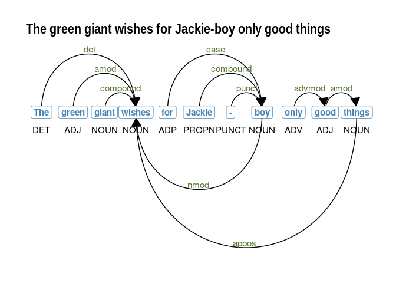

# NLP with R: some notes

A summary of some R-based, NLP workflows. I principally use the `udpipe`
(!) package for working with text data. It is a beast, and it keeps
things simple from a data class perspective (ie, data frames only).

------------------------------------------------------------------------

-   [NLP with R: some notes](#nlp-with-r:-some-notes)
    -   [Quick live text](#quick-live-text)
        -   [Online news articles](#online-news-articles)
        -   [PubMed abstracts](#pubmed-abstracts)
        -   [Tweets](#tweets)
    -   [Processing](#processing)
        -   [Tokenization](#tokenization)
        -   [Sentence tokenization](#sentence-tokenization)
        -   [Annotation](#annotation)
    -   [Multi-word expressions](#multi-word-expressions)
        -   [Collocations](#collocations)
        -   [Noun phrases](#noun-phrases)
        -   [Tokenizing multi-word
            expressions](#tokenizing-multi-word-expressions)
        -   [Dictionary-based entity
            recognition](#dictionary-based-entity-recognition)
        -   [Rebuilding text](#rebuilding-text)
    -   [doc2vec](#doc2vec)
    -   [Search](#search)
        -   [Search in context](#search-in-context)
        -   [Highlight](#highlight)
        -   [More complex patterns](#more-complex-patterns)
    -   [Odds](#odds)
        -   [Visualizing dependencies](#visualizing-dependencies)

## Quick live text

### Online news articles

``` r
library(tidyverse)
meta <- quicknews::qnews_get_newsmeta('joe biden')
news <- quicknews::qnews_extract_article(url = meta$link[1:20],
                                         cores = 7)
```

### PubMed abstracts

``` r
s0 <- PubmedMTK::pmtk_search_pubmed(search_term = 'medical marijuana', 
                                    fields = c('TIAB','MH'))

s1 <- PubmedMTK::pmtk_get_records2(pmids = s0$pmid, 
                                   cores = 3 #, 
                                   #ncbi_key = key
                                   )
```

### Tweets

``` r
congress_tweets <- rtweet::get_timeline( 
  house_meta$twitter, 
  n = 2000,
  check=FALSE) %>%
  mutate(created_at = as.Date(gsub(' .*$', '', created_at))) %>%
  filter(is_quote == 'FALSE' & 
           is_retweet == 'FALSE' & 
           created_at > '2019-01-02' &
           display_text_width > 0)
```

## Processing

### Tokenization

``` r
a1 <- corpus::text_tokens(news$text,
                          
  filter = corpus::text_filter(
    map_case = TRUE, 
    map_quote = TRUE,
    remove_ignorable = TRUE,
    combine = c(corpus::abbreviations_en),
    stemmer = NULL,
    stem_dropped = FALSE,
    stem_except = NULL,
    drop_letter = FALSE,
    drop_number = FALSE,
    drop_punct = FALSE,
    drop_symbol = FALSE,
    drop = NULL,
    drop_except = NULL,
    connector = '_',
    sent_crlf = FALSE)
  )

names(a1) <- 1:nrow(news)
```

### Sentence tokenization

``` r
sentences <- PubmedMTK::pmtk_toke_sentences(text = news$text,
                                            doc_id = 1:nrow(news))

sentences %>% head() %>% knitr::kable()
```

| doc_id | text                                                                                                                                                                                                                                                                                                                                                                                                                        |
|:-------|:----------------------------------------------------------------------------------------------------------------------------------------------------------------------------------------------------------------------------------------------------------------------------------------------------------------------------------------------------------------------------------------------------------------------------|
| 1.1    | In a city of ambitious influencers, a shadow cabinet hopes it can summon a new New Deal.                                                                                                                                                                                                                                                                                                                                    |
| 1.2    | Ruby Cramer is a senior staff writer at POLITICO and POLITICO Magazine.                                                                                                                                                                                                                                                                                                                                                     |
| 1.3    | One recent Wednesday evening, a small of group of concerned citizens gathered on a Zoom call to talk about how to get the attention of the president.                                                                                                                                                                                                                                                                       |
| 1.4    | At 6 p.m., two rows of elderly faces appeared on screen, staring into the camera: June Hopkins, Henry Scott Wallace, Tomlin Perkins Coggeshall and James Roosevelt Jr. If their names sound vaguely familiar it’s because their relatives—Harry Hopkins, Henry Wallace, Frances Perkins and Franklin Delano Roosevelt—formed the nucleus of one of the most famous and influential Oval Office rosters in American history. |
| 1.5    | Ninety years later, these descendants of the FDR administration have reconstituted his Cabinet.                                                                                                                                                                                                                                                                                                                             |
| 1.6    | And they have played their roles with a conscientious sense of purpose.                                                                                                                                                                                                                                                                                                                                                     |

### Annotation

``` r
setwd(paste0(udmodel_dir, 'model'))
udmodel <- udpipe::udpipe_load_model('english-ewt-ud-2.3-181115.udpipe')

x0 <- udpipe::udpipe(object = udmodel,
                     x = a1,
                     tagger = 'default', #'none'
                     parser = 'none')
```

## Multi-word expressions

### Collocations

``` r
collocations <- udpipe::collocation(x = x0,
                                    term = 'token',
                                    group = c('doc_id'),
                                    ngram_max = 5,
                                    sep = ' ')

collocations0 <- subset(collocations, freq > 1 & pmi > 5 &
                          !grepl('[[:punct:]]', keyword))

collocations0 %>% 
  sample_n(6) %>%
  mutate(pmi = round(pmi, 3)) %>%
  select(keyword, freq, pmi) %>%
  knitr::kable()
```

| keyword               | freq |    pmi |
|:----------------------|-----:|-------:|
| as well               |    8 |  7.142 |
| touch with the latest |    3 | 11.717 |
| ways you              |    3 |  8.329 |
| those who             |    3 |  6.461 |
| we would talk         |    3 | 11.398 |
| town hall             |    4 | 11.722 |

### Noun phrases

``` r
x0$phrase_tag <- udpipe::as_phrasemachine(x0$xpos, 
                                          type = "penn-treebank")

splits <- split(x0, f = x0$doc_id)

nps <- lapply(1:length(splits), function(x) {
  udpipe::keywords_phrases(x = splits[[x]]$phrase_tag,
                           term = splits[[x]]$token,
                           pattern = "(A|N)+N(P+D*(A|N)*N)*",
                           is_regex = TRUE,
                           ngram_max = 5,
                           detailed = TRUE,
                           sep = '_') })

names(nps) <- names(splits)
nps1 <- data.table::rbindlist(nps, idcol = 'doc_id')

nps1 %>%
  count(keyword, pattern, ngram) %>%
  sample_n(5) %>%
  knitr::kable()
```

| keyword                           | pattern | ngram |   n |
|:----------------------------------|:--------|------:|----:|
| space_flights                     | NN      |     2 |   1 |
| civil_rights_legislation          | ANN     |     3 |   1 |
| 1_trillion_infrastructure_package | AANN    |     4 |   1 |
| party_chair_jane                  | NNN     |     3 |   1 |
| criminal-justice_organization     | NN      |     2 |   1 |

### Tokenizing multi-word expressions

``` r
# lex$ngram <- stringr::str_count(lex$TermName,stringr::fixed('_')) + 1
# data.table::setDT(lex)
# ms <- subset(lex, lex$ngram > 1)

x0$newness <- udpipe::txt_recode_ngram(tolower(x0$token),
                                       compound = c(nps1$keyword),
                                       ngram = c(nps1$ngram),
                                       sep = '_')

x0 %>%
  select(doc_id, token:xpos, newness) %>%
  head() %>%
  knitr::kable()
```

| doc_id | token       | lemma      | upos | xpos | newness               |
|:-------|:------------|:-----------|:-----|:-----|:----------------------|
| 1      | in          | in         | ADP  | IN   | in                    |
| 1      | a           | a          | DET  | DT   | a                     |
| 1      | city        | city       | NOUN | NN   | city                  |
| 1      | of          | of         | ADP  | IN   | of                    |
| 1      | ambitious   | ambitious  | ADJ  | JJ   | ambitious_influencers |
| 1      | influencers | influencer | NOUN | NNS  | NA                    |

### Dictionary-based entity recognition

### Rebuilding text

## doc2vec

## Search

### Search in context

``` r
egs <- PubmedMTK::pmtk_locate_term(text = a1,
                                   doc_id = x0$doc_id,
                                   term = c('joe biden'),
                                   stem = F,
                                   window = 10)

egs %>% head() %>% knitr::kable()
```

| doc_id | lhs                                                                   | instance  | rhs                                                                 |
|:-------|:----------------------------------------------------------------------|:----------|:--------------------------------------------------------------------|
| 1      | legislative agenda as transformational as the new deal . they want    | joe biden | to embrace the idea of an “ activist ” government .                 |
| 1      | the senate to advance his bipartisan compromise last week , president | joe biden | took a big step toward upgrading america’s infrastructure .         |
| 1      | new york ( ap ) —                                                     | joe biden | wagered his campaign and now his presidency on the premise that     |
| 1      | . among independents , the downdraft hit 26 points . as               | joe biden | might say , “ gee , what happened ? ” if                            |
| 1      | how bad are things for                                                | joe biden | ? so bad that even the new york times is getting                    |
| 1      | washington ( ap ) — for president                                     | joe biden | and the senators laboring over a nearly $ 1 trillion infrastructure |

### Highlight

``` r
egs$kwic <- paste0('... ', egs$lhs, ' `', egs$instance, '` ', egs$rhs, ' ...')
knitr::kable(egs[1:8, c(1,5)])
```

| doc_id | kwic                                                                                                                                              |
|:-------|:--------------------------------------------------------------------------------------------------------------------------------------------------|
| 1      | … legislative agenda as transformational as the new deal . they want `joe biden` to embrace the idea of an “ activist ” government . …            |
| 1      | … the senate to advance his bipartisan compromise last week , president `joe biden` took a big step toward upgrading america’s infrastructure . … |
| 1      | … new york ( ap ) — `joe biden` wagered his campaign and now his presidency on the premise that …                                                 |
| 1      | … . among independents , the downdraft hit 26 points . as `joe biden` might say , “ gee , what happened ? ” if …                                  |
| 1      | … how bad are things for `joe biden` ? so bad that even the new york times is getting …                                                           |
| 1      | … washington ( ap ) — for president `joe biden` and the senators laboring over a nearly $ 1 trillion infrastructure …                             |
| 1      | … ( cnn ) president `joe biden` is tired of wearing a mask . …                                                                                    |
| 1      | … ( cnn ) want to see president `joe biden` in person ? consider a move to pennsylvania . …                                                       |

### More complex patterns

## Odds

### Visualizing dependencies

``` r
sentence <- "The green giant wishes for Jackie-boy only good things"
sent_depend <- udpipe::udpipe(udmodel, x = sentence)

plot_annotation <- function(x, size = 3){
  
  x <- x[!is.na(x$head_token_id), ]
  x <- x[x$sentence_id %in% min(x$sentence_id), ]
  edges <- x[x$head_token_id != 0, c("token_id", 
                                     "head_token_id", 
                                     "dep_rel")]
  edges$label <- edges$dep_rel
  
  g <- igraph::graph_from_data_frame(edges,
                                     vertices = x[, c("token_id",
                                                      "token",
                                                      "lemma",
                                                      "upos",
                                                      "xpos",
                                                      "feats")],
                                     directed = TRUE)
  
  ggraph::ggraph(g, layout = "linear") +
    ggraph::geom_edge_arc(ggplot2::aes(label = dep_rel, vjust = -0.20),
                          arrow = grid::arrow(length = unit(4, 'mm'), 
                                              ends = "last", 
                                              type = "closed"),
                          end_cap = ggraph::label_rect("w123"),
                          label_colour = "#55752f", 
                          check_overlap = TRUE, 
                          label_size = size) +
    
    ggraph::geom_node_label(ggplot2::aes(label = token), 
                            col = "steelblue", 
                            size = size, 
                            fontface = "bold") +
    
    ggraph::geom_node_text(ggplot2::aes(label = upos), 
                           nudge_y = -0.35, 
                           size = size) +
    
    ggraph::theme_graph() 
}


plot_annotation(sent_depend, size = 4) +
  labs(title = sentence)
```


