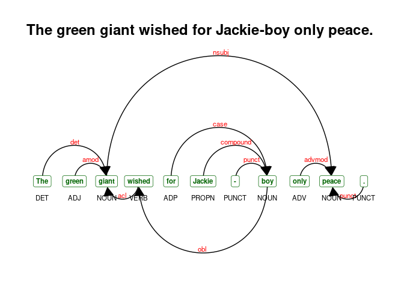

# nlp with r: some notes

A summary of some (more upstream) NLP workflows – mostly using the
[udpipe](https://github.com/bnosac/udpipe) and
[corpus](https://github.com/patperry/r-corpus) packages. Mostly notes to
self.

------------------------------------------------------------------------

-   [nlp with r: some notes](#nlp-with-r:-some-notes)
    -   [Quick live text](#quick-live-text)
        -   [Online news articles](#online-news-articles)
        -   [PubMed abstracts](#pubmed-abstracts)
        -   [Tweets](#tweets)
    -   [Processing](#processing)
        -   [Sentence splitting](#sentence-splitting)
        -   [Tokenization](#tokenization)
        -   [Tokens to data frame](#tokens-to-data-frame)
        -   [Vocabulary](#vocabulary)
    -   [Annotation](#annotation)
    -   [Multiword expressions](#multiword-expressions)
        -   [Collocations](#collocations)
        -   [Noun phrases](#noun-phrases)
        -   [Tokenizing multiword
            expressions](#tokenizing-multiword-expressions)
        -   [Annotation to DTM](#annotation-to-dtm)
        -   [Rebuilding text](#rebuilding-text)
    -   [doc2vec](#doc2vec)
    -   [Text summary via Pagerank](#text-summary-via-pagerank)
    -   [Search](#search)
        -   [Search in context](#search-in-context)
        -   [Sentences containing X](#sentences-containing-x)
    -   [Odds](#odds)
        -   [Visualizing dependencies](#visualizing-dependencies)
    -   [Summary](#summary)

## Quick live text

### Online news articles

``` r
library(tidyverse)
rss1 <- quicknews::qnews_build_rss(x = 'political ideology')
meta <- quicknews::qnews_strip_rss(rss1) 
news <- quicknews::qnews_extract_article(url = meta$link[1:10], cores = 7)

full <- news %>% left_join(meta)

strwrap(full$text[1], width = 60)[1:5]
```

    ## [1] "Anti-establishment sentiments are a key component of"       
    ## [2] "political opinion and behavior in the United States and are"
    ## [3] "distinct from traditional indicators of political ideology,"
    ## [4] "according to new research. The findings indicate"           
    ## [5] "anti-establishment viewpoints have played a key role in"

### PubMed abstracts

``` r
pmids <- PubmedMTK::pmtk_search_pubmed(search_term = 'political ideology', 
                                       fields = c('TIAB','MH'))
```

    ## [1] "political ideology[TIAB] OR political ideology[MH]: 498 records"

``` r
abstracts <- PubmedMTK::pmtk_get_records2(pmids = pmids$pmid[1:10], 
                                          cores = 3 #, 
                                          #ncbi_key = key
                                          )

strwrap(abstracts[[1]]$abstract, width = 60)[1:10]
```

    ##  [1] "This article explores the moral dimensions of the clinical" 
    ##  [2] "narration of suffering in a highly political context. Based"
    ##  [3] "on an ethnographic analysis of psychotherapists'"           
    ##  [4] "discussions of a clinical case related to the Israeli"      
    ##  [5] "evacuation from Gaza, I illustrate how the care providers"  
    ##  [6] "navigate competing moral logics while explaining the"       
    ##  [7] "reasons for the patient's experience. Capturing moments of" 
    ##  [8] "the simultaneous appearance of different explanatory"       
    ##  [9] "models, informed by contradictory moral grammars, during"   
    ## [10] "the process of clinical reasoning allowed me to obtain a"

### Tweets

``` r
tweets <-  rtweet::search_tweets(q = 'political ideology',
                                 n = 100,
                                 type = "recent",
                                 include_rts = FALSE,
                                 geocode = NULL,
                                 max_id = NULL,
                                 parse = TRUE,
                                 token = NULL)

strwrap(tweets$text[1], width = 60)
```

    ## [1] "Scientists need to study her. She's a rare political"       
    ## [2] "creature that has no ideology, save for an instinctive need"
    ## [3] "to take politically unpopular positions that hurt poor"     
    ## [4] "people"

## Processing

### Sentence splitting

``` r
abbrevs <- c(corpus::abbreviations_en, 'Gov.', 'Sen.')
```

``` r
c0 <- full$text
names(c0) <- full$doc_id

sentences <- corpus::text_split(c0, 
                                filter = corpus::text_filter(
                                  sent_suppress = abbrevs))

sentences$text <- as.character(sentences$text)
sentences$uid <- paste0(sentences$parent, '.', sentences$index)
colnames(sentences)[1:2] <- c('doc_id', 'sentence_id')

sentences %>% select(sentence_id, text) %>% head() %>% knitr::kable()
```

| sentence_id | text                                                                                                                                                                                                                                                                                                                                                                                                                                                                                                       |
|------------:|:-----------------------------------------------------------------------------------------------------------------------------------------------------------------------------------------------------------------------------------------------------------------------------------------------------------------------------------------------------------------------------------------------------------------------------------------------------------------------------------------------------------|
|           1 | Anti-establishment sentiments are a key component of political opinion and behavior in the United States and are distinct from traditional indicators of political ideology, according to new research.                                                                                                                                                                                                                                                                                                    |
|           2 | The findings indicate anti-establishment viewpoints have played a key role in some beliefs that came to prominence during the Trump era, such as the QAnon movement.                                                                                                                                                                                                                                                                                                                                       |
|           3 | The research has been published in the American Journal of Political Science and The Forum.                                                                                                                                                                                                                                                                                                                                                                                                                |
|           4 | “I was interested in this project because it increasingly seemed to me that polarization and political identities were increasingly bearing the brunt of the blame –– perhaps erroneously –– for socially undesirable beliefs and actions that were probably the product of other orientations, like conspiracy thinking and a tendency to view politics as a struggle between good and evil,” said co-author Adam M. Enders, an assistant professor of political science at the University of Louisville. |
|           5 | “American politics seems to be different than in previous decades and we wanted to know why,” added co-author Joseph E. Uscinski of the University of Miami.                                                                                                                                                                                                                                                                                                                                               |
|           6 | “Many people blame current political problems — conspiracy theories, fake news, political violence — on polarization.                                                                                                                                                                                                                                                                                                                                                                                      |

### Tokenization

> The `text_tokens` function from the `corpus` package provides a host
> of options for text tokenization.

``` r
tokens <- corpus::text_tokens(sentences$text,
                          
  filter = corpus::text_filter(
    map_case = FALSE, 
    map_quote = TRUE,
    remove_ignorable = TRUE,
    combine = abbrevs,
    stemmer = NULL,
    stem_dropped = FALSE,
    stem_except = NULL,
    drop_letter = FALSE,
    drop_number = FALSE,
    drop_punct = FALSE,
    drop_symbol = FALSE,
    drop = NULL,
    drop_except = NULL,
    connector = '_',
    sent_crlf = FALSE)
  )

names(tokens) <-sentences$uid
tokens[[1]]
```

    ##  [1] "Anti-establishment" "sentiments"         "are"               
    ##  [4] "a"                  "key"                "component"         
    ##  [7] "of"                 "political"          "opinion"           
    ## [10] "and"                "behavior"           "in"                
    ## [13] "the"                "United"             "States"            
    ## [16] "and"                "are"                "distinct"          
    ## [19] "from"               "traditional"        "indicators"        
    ## [22] "of"                 "political"          "ideology"          
    ## [25] ","                  "according"          "to"                
    ## [28] "new"                "research"           "."

### Tokens to data frame

> A simple approach to reshaping token objects. Via the `textshape`
> package.

``` r
df <- textshape::tidy_list(tokens, 
                           id.name = 'doc_id', 
                           content.name = 'token')

####
df[, sentence_id := gsub('^.*\\.', '', doc_id)]
df[, doc_id := gsub('\\..*$', '', doc_id)]
df[, token_id := data.table::rowid(doc_id)]

df %>%  slice(1:10)
```

    ##     doc_id              token sentence_id token_id
    ##  1:      1 Anti-establishment           1        1
    ##  2:      1         sentiments           1        2
    ##  3:      1                are           1        3
    ##  4:      1                  a           1        4
    ##  5:      1                key           1        5
    ##  6:      1          component           1        6
    ##  7:      1                 of           1        7
    ##  8:      1          political           1        8
    ##  9:      1            opinion           1        9
    ## 10:      1                and           1       10

### Vocabulary

``` r
vocab <- df[, list(text_freq = .N, 
                          doc_freq = length(unique(doc_id))), 
              by = list(token)]

head(vocab)
```

    ##                 token text_freq doc_freq
    ## 1: Anti-establishment         2        1
    ## 2:         sentiments         3        1
    ## 3:                are        27        6
    ## 4:                  a       116        9
    ## 5:                key         2        1
    ## 6:          component         1        1

## Annotation

``` r
setwd(paste0(udmodel_dir, 'model'))
udmodel <- udpipe::udpipe_load_model('english-ewt-ud-2.3-181115.udpipe')
```

> The `udpipe` package can be used to annotate simple text or token
> objects. The utility of annotating a token object versus simple text,
> however, is that the user specifies what constitutes a token and what
> constitutes a sentence.

``` r
tokens1 <- lapply(tokens, c, '\n')
names(tokens1) <- gsub('\\..*$', '', names(tokens1))

tokens2 <- sapply(unique(names(tokens1)), 
       function(z) unname(unlist(tokens1[names(tokens1) == z])), 
       simplify=FALSE)
```

``` r
annotation <- udpipe::udpipe(object = udmodel,
                             x = tokens2,
                             tagger = 'default', 
                             parser = 'default')

colnames(annotation)
```

    ##  [1] "doc_id"        "paragraph_id"  "sentence_id"   "sentence"     
    ##  [5] "start"         "end"           "term_id"       "token_id"     
    ##  [9] "token"         "lemma"         "upos"          "xpos"         
    ## [13] "feats"         "head_token_id" "dep_rel"       "deps"         
    ## [17] "misc"

``` r
annotation %>%
  select(doc_id, sentence_id, token_id:xpos) %>%
  head() %>%
  knitr::kable()
```

| doc_id | sentence_id | token_id | token              | lemma              | upos | xpos |
|:-------|------------:|:---------|:-------------------|:-------------------|:-----|:-----|
| 1      |           1 | 1        | Anti-establishment | Anti-establishment | ADJ  | JJ   |
| 1      |           1 | 2        | sentiments         | sentiment          | NOUN | NNS  |
| 1      |           1 | 3        | are                | be                 | AUX  | VBP  |
| 1      |           1 | 4        | a                  | a                  | DET  | DT   |
| 1      |           1 | 5        | key                | key                | ADJ  | JJ   |
| 1      |           1 | 6        | component          | component          | NOUN | NN   |

## Multiword expressions

### Collocations

``` r
collocations <- udpipe::collocation(x = annotation,
                                    term = 'token',
                                    group = c('doc_id'),
                                    ngram_max = 5,
                                    sep = ' ')

collocations0 <- subset(collocations, freq > 1 & pmi > 5 &
                          !grepl('[[:punct:]]', keyword))

collocations0 %>% 
  sample_n(6) %>%
  mutate(pmi = round(pmi, 3)) %>%
  select(keyword, freq, pmi) %>%
  knitr::kable()
```

| keyword              | freq |    pmi |
|:---------------------|-----:|-------:|
| published in         |    3 |  5.814 |
| to me                |    3 |  5.402 |
| better understand    |    3 | 10.622 |
| Imran Khan           |    6 |  9.300 |
| in the United States |    3 | 10.617 |
| has been             |    5 |  8.073 |

### Noun phrases

``` r
annotation$phrase_tag <- udpipe::as_phrasemachine(annotation$xpos, 
                                                  type = "penn-treebank")

splits <- split(annotation, f = annotation$doc_id)

## lapply to preserve doc_id info
nps <- lapply(1:length(splits), function(x) {
  udpipe::keywords_phrases(x = splits[[x]]$phrase_tag,
                           term = splits[[x]]$token,
                           pattern = "(A|N)+N(P+D*(A|N)*N)*",
                           is_regex = TRUE,
                           ngram_max = 5,
                           detailed = TRUE,
                           sep = '_') })

names(nps) <- names(splits)
nps1 <- data.table::rbindlist(nps, idcol = 'doc_id')

nps1 %>%
  count(keyword, pattern, ngram) %>%
  sample_n(5) %>%
  knitr::kable()
```

| keyword                     | pattern | ngram |   n |
|:----------------------------|:--------|------:|----:|
| informal_far-right_movement | ANN     |     3 |   1 |
| social_media                | AN      |     2 |   9 |
| Trump_page                  | NN      |     2 |   1 |
| social_media_platform       | ANN     |     3 |   2 |
| years_Imran                 | NN      |     2 |   1 |

### Tokenizing multiword expressions

> Recode noun phrases identified above as a single token in annotation
> data frame.

``` r
# lex$ngram <- stringr::str_count(lex$TermName,stringr::fixed('_')) + 1
# data.table::setDT(lex)
# ms <- subset(lex, lex$ngram > 1)

annotation$newness <- udpipe::txt_recode_ngram(tolower(annotation$token),
                                               compound = c(nps1$keyword),
                                               ngram = c(nps1$ngram),
                                               sep = '_')
```

### Annotation to DTM

> Per the annotation structure above, we can (1) cast into a
> document-term matrix and (2) normalize vocabulary to the lemma in one
> fell swoop.

``` r
annotation0 <- annotation %>%
  filter(!is.na(newness)) %>%
  mutate(newness = ifelse(grepl('_', newness), newness, lemma)) 

dtm <- annotation0 %>% 
  count(doc_id, newness) %>%
  tidytext::cast_sparse(row = doc_id,
                        column = newness,
                        value = n)
str(dtm)
```

    ## Formal class 'dgCMatrix' [package "Matrix"] with 6 slots
    ##   ..@ i       : int [1:2501] 0 4 5 6 7 0 1 2 3 4 ...
    ##   ..@ p       : int [1:1718] 0 5 14 18 22 24 33 39 45 50 ...
    ##   ..@ Dim     : int [1:2] 9 1717
    ##   ..@ Dimnames:List of 2
    ##   .. ..$ : chr [1:9] "1" "2" "3" "4" ...
    ##   .. ..$ : chr [1:1717] "-" "," ";" ":" ...
    ##   ..@ x       : num [1:2501] 10 2 3 1 2 79 30 48 54 9 ...
    ##   ..@ factors : list()

### Rebuilding text

``` r
new_text <- data.table::setDT(annotation0)[, list(text = paste(newness, collapse = " ")), 
                                  by = doc_id]

strwrap(new_text$text[1], width = 60)[1:5]
```

    ## [1] "anti-establishment_sentiments be a"                      
    ## [2] "key_component_of_political_opinion and behavior in the"  
    ## [3] "United States and be distinct from"                      
    ## [4] "traditional_indicators_of_political_ideology , accord to"
    ## [5] "new_research . the finding indicate"

## doc2vec

``` r
new_text$nwords <- tokenizers::count_words(new_text$text)
new_text0 <- subset(new_text, nwords < 1000 & nchar(text) > 0)

set.seed(9)
model.d2v <- doc2vec::paragraph2vec(x = new_text0, 
                                    type = "PV-DM", 
                                    dim = 100, 
                                    iter = 20,
                                    min_count = 2, 
                                    lr = 0.05, 
                                    threads = 1)

embedding.words <- as.matrix(model.d2v, which = "words")
embedding.docs <- as.matrix(model.d2v,   which = "docs")

both <- do.call(rbind, list(embedding.docs, embedding.words))
```

> doc2vec is a powerful NLP tool because it projects documents and terms
> in the same embedding space.

``` r
predict(model.d2v, 'find', 
        type = "nearest",
        which = "word2word")[[1]]
```

    ##    term1      term2 similarity rank
    ## 1   find researcher  0.9557187    1
    ## 2   find       show  0.9496294    2
    ## 3   find  exemption  0.9461185    3
    ## 4   find    compare  0.9441468    4
    ## 5   find        not  0.9369903    5
    ## 6   find     either  0.9322490    6
    ## 7   find  meanwhile  0.9292600    7
    ## 8   find       role  0.9269795    8
    ## 9   find    overall  0.9248223    9
    ## 10  find       even  0.9078073   10

## Text summary via Pagerank

## Search

### Search in context

``` r
ctrialsgov::ctgov_kwic(term = 'political ideology|party affiliation', 
                       text = abstracts[[1]]$abstract, 
                       names = abstracts[[1]]$pmid, 
                       width = 35,
                       #use_color = T,
                       output = 'cat') #'data.frame'
```

    ## [34665062]  a priori moral values informed by |political ideology|. This perspective is particularly 
    ## [34630247]                       The dominant |political ideology| of recent decades, neoliberalism, 
    ## [34605280] ity, positive COVID diagnosis, and |political ideology|. Univariate analysis and logistic 
    ## [34594280] pers, blogs, and social networks), |political ideology|, vote, trust in institutions, and 
    ## [34592973] tion. As in studies of the public, |political ideology| and the observation of local clima
    ## [34580214]  variables and only weakly reflect |political ideology|. Moral cosmopolitanism also differ
    ## [34545946]  when assessed together, political |party affiliation| (e.g., Republican, Democrat) but n
    ## [34545946] .g., Republican, Democrat) but not |political ideology| (e.g., conservative, liberal) pred
    ## [34545946]  When assessed together, political |party affiliation| but not political ideology signifi
    ## [34545946] olitical party affiliation but not |political ideology| significantly predicted face mask 
    ## [34508051] ucts in relationships moderated by |political ideology|. Public health messages targeting

### Sentences containing X

``` r
eg_sentences <- df[, if(any(token %in% c('QAnon'))) .SD, 
                    by = list(doc_id, sentence_id)]

eg_sentences0 <- eg_sentences[, list(text = paste(token, collapse = " ")), 
                                by = list(doc_id,sentence_id)]

eg_sentences0 %>% head() %>% knitr::kable()
```

| doc_id | sentence_id | text                                                                                                                                                                                                                                                                                                                                      |
|:-------|:------------|:------------------------------------------------------------------------------------------------------------------------------------------------------------------------------------------------------------------------------------------------------------------------------------------------------------------------------------------|
| 1      | 2           | The findings indicate anti-establishment viewpoints have played a key role in some beliefs that came to prominence during the Trump era , such as the QAnon movement .                                                                                                                                                                    |
| 1      | 26          | Ender and Uscinski’s research published in The Forum , based on a national survey of 1,947 U.S. adults conducted between October 8 and 21 , 2020 , found that anti-establishment orientations were also strongly related to the endorsement of conspiracies related to COVID-19 , QAnon , Donald Trump , and the 2020 election .          |
| 1      | 27          | For example , agreement with statements such as “ Satanic sex traffickers control the government ” ( QAnon ) and “ There is a conspiracy to stop the U.S. Post Office from processing mail-in ballots ” ( election fraud ) were weakly related to political ideology , but strongly related to having an anti-establishment orientation . |

## Odds

### Visualizing dependencies

``` r
sentence <- "The green giant wished for Jackie-boy only peace."
sent_depend <- udpipe::udpipe(udmodel, x = sentence)

textplot::textplot_dependencyparser(sent_depend, 
                                    title = sentence, 
                                    subtitle = NULL)
```



## Summary
