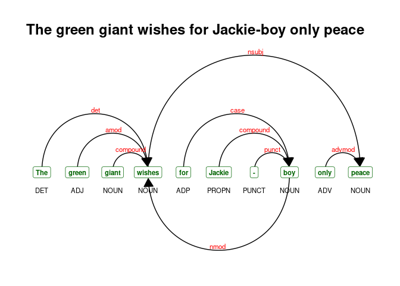

# nlp with r: some notes

A summary of some (more upstream) NLP workflows – mostly using the
[udpipe](https://github.com/bnosac/udpipe) and
[corpus](https://github.com/patperry/r-corpus) packages. Mostly notes to
self.

------------------------------------------------------------------------

-   [nlp with r: some notes](#nlp-with-r:-some-notes)
    -   [Quick live text](#quick-live-text)
        -   [Online news articles](#online-news-articles)
        -   [PubMed abstracts](#pubmed-abstracts)
        -   [Tweets](#tweets)
    -   [Processing](#processing)
        -   [Sentence splitting](#sentence-splitting)
        -   [Tokenization](#tokenization)
        -   [Tokens to data frame](#tokens-to-data-frame)
        -   [Vocabulary](#vocabulary)
    -   [Annotation](#annotation)
    -   [Multiword expressions](#multiword-expressions)
        -   [Collocations](#collocations)
        -   [Noun phrases](#noun-phrases)
        -   [Tokenizing multiword
            expressions](#tokenizing-multiword-expressions)
        -   [Annotation to DTM](#annotation-to-dtm)
        -   [Rebuilding text](#rebuilding-text)
    -   [doc2vec](#doc2vec)
    -   [Search](#search)
        -   [Search in context](#search-in-context)
        -   [Sentences containing X](#sentences-containing-x)
    -   [Odds](#odds)
        -   [Visualizing dependencies](#visualizing-dependencies)
    -   [Summary](#summary)

## Quick live text

### Online news articles

``` r
library(tidyverse)
meta <- quicknews::qnews_get_newsmeta('joe biden')
news <- quicknews::qnews_extract_article(url = meta$link[1:20],
                                         cores = 7)

strwrap(news$text[10], width = 60)[1:5]
```

    ## [1] "Joe Biden has no interest in your facts. Those are from" 
    ## [2] "four or five days ago. Or, actually, two. In his"        
    ## [3] "contentious interview with ABC’s George Stephanopoulos —"
    ## [4] "his sentences jumbled together, alternately rambling and"
    ## [5] "insisting with vociferous certainty things that were not"

### PubMed abstracts

``` r
pmids <- PubmedMTK::pmtk_search_pubmed(search_term = 'medical marijuana', 
                                       fields = c('TIAB','MH'))
```

    ## [1] "medical marijuana[TIAB] OR medical marijuana[MH]: 2224 records"

``` r
abstracts <- PubmedMTK::pmtk_get_records2(pmids = pmids$pmid[1:10], 
                                          cores = 3 #, 
                                          #ncbi_key = key
                                          )

strwrap(abstracts[[1]]$abstract, width = 60)[1:10]
```

    ##  [1] "The authors sought to estimate the prevalence of"           
    ##  [2] "past-12-month and lifetime cannabis use and cannabis use"   
    ##  [3] "disorder among U.S. veterans; to describe demographic,"     
    ##  [4] "substance use disorder, and psychiatric disorder correlates"
    ##  [5] "of nonmedical cannabis use and cannabis use disorder; and"  
    ##  [6] "to explore differences in cannabis use and cannabis use"    
    ##  [7] "disorder prevalence among veterans in states with and"      
    ##  [8] "without medical marijuana laws. Participants were 3,119"    
    ##  [9] "respondents in the 2012-2013 National Epidemiologic Survey" 
    ## [10] "on Alcohol and Related Conditions-III (NESARC-III) who"

### Tweets

``` r
tweets <-  rtweet::search_tweets(q = '#Jan6',
                                 n = 100,
                                 type = "recent",
                                 include_rts = FALSE,
                                 geocode = NULL,
                                 max_id = NULL,
                                 parse = TRUE,
                                 token = NULL)

strwrap(tweets$text[1], width = 60)
```

    ## [1] "@just_security @justinhendrix While we wait for @Jim_Jordan"
    ## [2] "to be indicted for his role in instigating the #Jan6 attack"
    ## [3] "against Congress, we can look forward to electing an"       
    ## [4] "honorable person to his seat: @Sites4Congress"

## Processing

### Sentence splitting

> The `pmtk_split_sentences` function from the `PumbedMTK` package is a
> simple wrapper to the `corpus::text_split` function. The function is
> mindful of stops used in titles/honorifics (eg, Mr., Dr., Ms., etc.)
> and common acronyms (eg, U.S.A.) when delineating sentences.

``` r
sentences <- PubmedMTK::pmtk_split_sentences(text = news$text,
                                             doc_id = 1:nrow(news))

sentences %>% head() %>% knitr::kable()
```

| doc_id | text                                                                                                                                                                                                                             |
|:-------|:---------------------------------------------------------------------------------------------------------------------------------------------------------------------------------------------------------------------------------|
| 1.1    | Foreign policy experts are asking how decades of foreign policy experience could have led President Biden to oversee such a chaotic withdrawal.                                                                                  |
| 1.2    | In January 2002, when the U.S. Embassy in Afghanistan reopened for the first time since 1989, Ambassador Ryan Crocker said the first member of Congress to visit him in Kabul was the then-senator from Delaware, Joe Biden.     |
| 1.3    | “One of his really great qualities, I thought, was his driving need to see things for himself … and I just really respected that,” Crocker said, pointing out that Biden also visited Iraq many times.                           |
| 1.4    | Crocker had considered the president an old-school internationalist, in the vein of presidents going back to World War II who believed in U.S. leadership on the global stage and spearheaded large international organizations. |
| 1.5    | But with the havoc unfolding in Afghanistan, Crocker says he can no longer make sense of the man he once thought would restore American credibility and international order after President Trump.                               |
| 1.6    | "What have they done with the real Joe Biden?                                                                                                                                                                                    |

### Tokenization

> The `text_tokens` function from the `corpus` package provides a host
> of options for text tokenization.

``` r
tokens <- corpus::text_tokens(sentences$text,
                          
  filter = corpus::text_filter(
    map_case = FALSE, 
    map_quote = TRUE,
    remove_ignorable = TRUE,
    combine = c(corpus::abbreviations_en),
    stemmer = NULL,
    stem_dropped = FALSE,
    stem_except = NULL,
    drop_letter = FALSE,
    drop_number = FALSE,
    drop_punct = FALSE,
    drop_symbol = FALSE,
    drop = NULL,
    drop_except = NULL,
    connector = '_',
    sent_crlf = FALSE)
  )

names(tokens) <-sentences$doc_id
tokens[[1]]
```

    ##  [1] "Foreign"    "policy"     "experts"    "are"        "asking"    
    ##  [6] "how"        "decades"    "of"         "foreign"    "policy"    
    ## [11] "experience" "could"      "have"       "led"        "President" 
    ## [16] "Biden"      "to"         "oversee"    "such"       "a"         
    ## [21] "chaotic"    "withdrawal" "."

### Tokens to data frame

> A simple approach to reshaping token objects.

``` r
tokens_df <- PubmedMTK::pmtk_cast_tokens(tokens)
tokens_df %>%  slice(1:10)
```

    ##     doc_id sentence_id token_id   token
    ##  1:      1           1        1 Foreign
    ##  2:      1           1        2  policy
    ##  3:      1           1        3 experts
    ##  4:      1           1        4     are
    ##  5:      1           1        5  asking
    ##  6:      1           1        6     how
    ##  7:      1           1        7 decades
    ##  8:      1           1        8      of
    ##  9:      1           1        9 foreign
    ## 10:      1           1       10  policy

### Vocabulary

``` r
vocab <- tokens_df[, list(text_freq = .N, 
                          doc_freq = length(unique(doc_id))), 
              by = list(token)]

head(vocab)
```

    ##      token text_freq doc_freq
    ## 1: Foreign         2        1
    ## 2:  policy        24        6
    ## 3: experts         3        1
    ## 4:     are        47       12
    ## 5:  asking         2        2
    ## 6:     how        12        5

## Annotation

``` r
setwd(paste0(udmodel_dir, 'model'))
udmodel <- udpipe::udpipe_load_model('english-ewt-ud-2.3-181115.udpipe')
```

> The `udpipe` package can be used to annotate simple text or token
> objects. The utility of annotating a token object versus simple text,
> however, is that the user specifies what constitutes a token and what
> constitutes a sentence.

> One issue with token objects is that sentence info is less obvious to
> annotators. The `pmtk_rebuild_sentences` function hacks around this by
> adding a newline character to the end of every tokenized sentence in
> the corpus, and aggregating the sentence-level tokens to
> document-level.

``` r
tokens1 <- PubmedMTK::pmtk_rebuild_sentences(x = tokens,
                                             sentence_id = names(tokens))
```

``` r
annotation <- udpipe::udpipe(object = udmodel,
                             x = tokens1,
                             tagger = 'default', 
                             parser = 'default')

colnames(annotation)
```

    ##  [1] "doc_id"        "paragraph_id"  "sentence_id"   "sentence"     
    ##  [5] "start"         "end"           "term_id"       "token_id"     
    ##  [9] "token"         "lemma"         "upos"          "xpos"         
    ## [13] "feats"         "head_token_id" "dep_rel"       "deps"         
    ## [17] "misc"

``` r
annotation %>%
  select(doc_id, sentence_id, token_id:xpos) %>%
  head() %>%
  knitr::kable()
```

| doc_id | sentence_id | token_id | token   | lemma   | upos | xpos |
|:-------|------------:|:---------|:--------|:--------|:-----|:-----|
| 1      |           1 | 1        | Foreign | foreign | ADJ  | JJ   |
| 1      |           1 | 2        | policy  | policy  | NOUN | NN   |
| 1      |           1 | 3        | experts | expert  | NOUN | NNS  |
| 1      |           1 | 4        | are     | be      | AUX  | VBP  |
| 1      |           1 | 5        | asking  | ask     | VERB | VBG  |
| 1      |           1 | 6        | how     | how     | ADV  | WRB  |

## Multiword expressions

### Collocations

``` r
collocations <- udpipe::collocation(x = annotation,
                                    term = 'token',
                                    group = c('doc_id'),
                                    ngram_max = 5,
                                    sep = ' ')

collocations0 <- subset(collocations, freq > 1 & pmi > 5 &
                          !grepl('[[:punct:]]', keyword))

collocations0 %>% 
  sample_n(6) %>%
  mutate(pmi = round(pmi, 3)) %>%
  select(keyword, freq, pmi) %>%
  knitr::kable()
```

| keyword                       | freq |    pmi |
|:------------------------------|-----:|-------:|
| Cillizza will delve a         |    3 |  5.834 |
| weekly YouTube                |    3 | 11.947 |
| trying to                     |    5 |  5.439 |
| In each episode               |    3 | 11.944 |
| deeper into the surreal world |    3 |  9.824 |
| will delve a little           |    3 | 11.942 |

### Noun phrases

``` r
annotation$phrase_tag <- udpipe::as_phrasemachine(annotation$xpos, 
                                                  type = "penn-treebank")

splits <- split(annotation, f = annotation$doc_id)

## lapply to preserve doc_id info
nps <- lapply(1:length(splits), function(x) {
  udpipe::keywords_phrases(x = splits[[x]]$phrase_tag,
                           term = splits[[x]]$token,
                           pattern = "(A|N)+N(P+D*(A|N)*N)*",
                           is_regex = TRUE,
                           ngram_max = 5,
                           detailed = TRUE,
                           sep = '_') })

names(nps) <- names(splits)
nps1 <- data.table::rbindlist(nps, idcol = 'doc_id')

nps1 %>%
  count(keyword, pattern, ngram) %>%
  sample_n(5) %>%
  knitr::kable()
```

| keyword                        | pattern | ngram |   n |
|:-------------------------------|:--------|------:|----:|
| Durham_quick                   | NN      |     2 |   1 |
| Olivia_Troye                   | NN      |     2 |   1 |
| Rick_Flagg                     | NN      |     2 |   1 |
| transit_point_for_the_refugees | NNPDN   |     5 |   1 |
| Rep.\_Anna_Eshoo               | NNN     |     3 |   1 |

### Tokenizing multiword expressions

> Recode noun phrases identified above as a single token in annotation
> data frame.

``` r
# lex$ngram <- stringr::str_count(lex$TermName,stringr::fixed('_')) + 1
# data.table::setDT(lex)
# ms <- subset(lex, lex$ngram > 1)

annotation$newness <- udpipe::txt_recode_ngram(tolower(annotation$token),
                                               compound = c(nps1$keyword),
                                               ngram = c(nps1$ngram),
                                               sep = '_')

annotation %>%
  select(doc_id, token:xpos, newness) %>%
  filter(grepl('_', newness)) %>%
  head() %>%
  knitr::kable()
```

| doc_id | token   | lemma   | upos | xpos | newness                   |
|:-------|:--------|:--------|:-----|:-----|:--------------------------|
| 1      | Foreign | foreign | ADJ  | JJ   | foreign_policy_experts    |
| 1      | foreign | foreign | ADJ  | JJ   | foreign_policy_experience |
| 1      | chaotic | chaotic | ADJ  | JJ   | chaotic_withdrawal        |
| 1      | first   | first   | ADJ  | JJ   | first_time                |
| 1      | first   | first   | ADJ  | JJ   | first_member              |
| 1      | great   | great   | ADJ  | JJ   | great_qualities           |

### Annotation to DTM

> Per the annotation structure above, we can (1) cast into a
> document-term matrix and (2) normalize vocabulary to the lemma in one
> fell swoop.

``` r
annotation0 <- annotation %>%
  filter(!is.na(newness)) %>%
  mutate(newness = ifelse(grepl('_', newness), newness, lemma)) 

dtm <- annotation0 %>% 
  count(doc_id, newness) %>%
  tidytext::cast_sparse(row = doc_id,
                        column = newness,
                        value = n)
str(dtm)
```

    ## Formal class 'dgCMatrix' [package "Matrix"] with 6 slots
    ##   ..@ i       : int [1:4641] 0 1 2 3 5 6 8 9 10 11 ...
    ##   ..@ p       : int [1:2588] 0 14 33 43 50 69 80 82 84 85 ...
    ##   ..@ Dim     : int [1:2] 19 2587
    ##   ..@ Dimnames:List of 2
    ##   .. ..$ : chr [1:19] "1" "10" "11" "12" ...
    ##   .. ..$ : chr [1:2587] "-" "," ":" "?" ...
    ##   ..@ x       : num [1:4641] 4 10 2 1 2 1 4 2 2 2 ...
    ##   ..@ factors : list()

### Rebuilding text

``` r
new_text <- data.table::setDT(annotation0)[, list(text = paste(newness, collapse = " ")), 
                                  by = doc_id]

strwrap(new_text$text[5], width = 60)[1:5]
```

    ## [1] "Nrplus member article J oe Biden have do many_things in he" 
    ## [2] "statement about Afghanistan over the last_week , from he"   
    ## [3] "speech last Monday to he brief_press_conference Sunday"     
    ## [4] "afternoon . He' critique afghan leader , blame Donald Trump"
    ## [5] ", deny he could have know what would happen , and paint"

## doc2vec

``` r
new_text$nwords <- tokenizers::count_words(new_text$text)
new_text0 <- subset(new_text, nwords < 1000 & nchar(text) > 0)

set.seed(9)
model.d2v <- doc2vec::paragraph2vec(x = new_text0, 
                                    type = "PV-DM", 
                                    dim = 100, 
                                    iter = 20,
                                    min_count = 2, 
                                    lr = 0.05, 
                                    threads = 1)

embedding.words <- as.matrix(model.d2v, which = "words")
embedding.docs <- as.matrix(model.d2v,   which = "docs")

both <- do.call(rbind, list(embedding.docs, embedding.words))
```

> doc2vec is a powerful NLP tool because it projects documents and terms
> in the same embedding space.

``` r
predict(model.d2v, 'Biden', 
        type = "nearest",
        which = "word2word")[[1]]
```

    ##    term1     term2 similarity rank
    ## 1  Biden      week  0.9275486    1
    ## 2  Biden     blame  0.9252347    2
    ## 3  Biden   Sánchez  0.9113157    3
    ## 4  Biden         )  0.9069669    4
    ## 5  Biden      time  0.9028502    5
    ## 6  Biden President  0.8952557    6
    ## 7  Biden   Bongino  0.8931653    7
    ## 8  Biden       Joe  0.8885962    8
    ## 9  Biden       CNN  0.8841720    9
    ## 10 Biden       Dan  0.8729199   10

## Search

### Search in context

> Based on the `corpus::text_locate` function.

``` r
egs <- PubmedMTK::pmtk_locate_term(text = tokens,
                                   doc_id = names(tokens),
                                   term = c('joe biden'),
                                   stem = F,
                                   window = 10)

egs %>% head() %>% knitr::kable()
```

| doc_id | lhs                                                              | instance  | rhs                                                                 |
|:-------|:-----------------------------------------------------------------|:----------|:--------------------------------------------------------------------|
| 1.2    | to visit him in Kabul was the then-senator from Delaware ,       | Joe Biden | .                                                                   |
| 1.6    | " What have they done with the real                              | Joe Biden | ?                                                                   |
| 1.68   | " I think                                                        | Joe Biden | sees Afghanistan as a distraction from the defining fight that he’s |
| 2.1    | ( CNN )                                                          | Joe Biden | believes that you don’t care about Afghanistan .                    |
| 3.1    | op-ed in one of Britain’s largest newspapers has taken aim at    | Joe Biden | , calling the 78-year-old president " exhausted " and " too         |
| 6.16   | this because I’m about to say something nice about our president | Joe Biden | .                                                                   |

### Sentences containing X

``` r
jrb_sentences <- tokens_df[, if(any(token == 'Biden')) .SD, 
                    by = list(doc_id,sentence_id)]

jrb_sentences0 <- jrb_sentences[, list(text = paste(token, collapse = " ")), 
                                by = list(doc_id,sentence_id)]

jrb_sentences0 %>% head() %>% knitr::kable()
```

| doc_id | sentence_id | text                                                                                                                                                                                                                             |
|:-------|:------------|:---------------------------------------------------------------------------------------------------------------------------------------------------------------------------------------------------------------------------------|
| 1      | 1           | Foreign policy experts are asking how decades of foreign policy experience could have led President Biden to oversee such a chaotic withdrawal .                                                                                 |
| 1      | 2           | In January 2002 , when the U.S. Embassy in Afghanistan reopened for the first time since 1989 , Ambassador Ryan Crocker said the first member of Congress to visit him in Kabul was the then-senator from Delaware , Joe Biden . |
| 1      | 3           | " One of his really great qualities , I thought , was his driving need to see things for himself . . . and I just really respected that , " Crocker said , pointing out that Biden also visited Iraq many times .                |
| 1      | 6           | " What have they done with the real Joe Biden ?                                                                                                                                                                                  |
| 1      | 17          | Biden blamed the former Afghan government for pushing against an earlier start to evacuations .                                                                                                                                  |
| 1      | 31          | Biden " has always had strong views about our role in Afghanistan , " Panetta said .                                                                                                                                             |

## Odds

### Visualizing dependencies

``` r
sentence <- "The green giant wishes for Jackie-boy only peace"
sent_depend <- udpipe::udpipe(udmodel, x = sentence)

textplot::textplot_dependencyparser(sent_depend, 
                                    title = sentence, 
                                    subtitle = NULL)
```



## Summary
