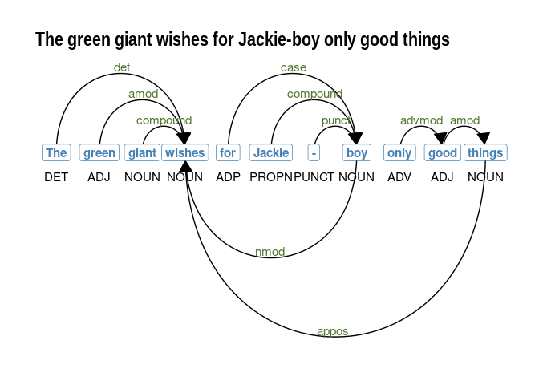

NLP with R: some notes
======================

A summary of some R-based, NLP workflows – mostly using `udpipe`.

------------------------------------------------------------------------

-   [NLP with R: some notes](#nlp-with-r:-some-notes)
    -   [Quick live text](#quick-live-text)
        -   [Online news articles](#online-news-articles)
        -   [PubMed abstracts](#pubmed-abstracts)
        -   [Tweets](#tweets)
    -   [Processing](#processing)
        -   [Tokenization](#tokenization)
        -   [Sentence tokenization](#sentence-tokenization)
        -   [Annotation](#annotation)
    -   [Multi-word expressions](#multi-word-expressions)
        -   [Collocations](#collocations)
        -   [Noun phrases](#noun-phrases)
        -   [Tokenizing multi-word
            expressions](#tokenizing-multi-word-expressions)
        -   [Annotation to DTM](#annotation-to-dtm)
        -   [Rebuilding text](#rebuilding-text)
    -   [doc2vec](#doc2vec)
    -   [Search](#search)
        -   [Search in context](#search-in-context)
        -   [More complex patterns](#more-complex-patterns)
    -   [Odds](#odds)
        -   [Visualizing dependencies](#visualizing-dependencies)

Quick live text
---------------

### Online news articles

``` r
library(tidyverse)
meta <- quicknews::qnews_get_newsmeta('joe biden')
news <- quicknews::qnews_extract_article(url = meta$link[1:20],
                                         cores = 7)

strwrap(news$text[10], width = 60)[1:5]
```

    ## [1] "Joe Biden won by promising less. Vocal factions in the"     
    ## [2] "Democratic Party and beyond saw Hillary Clinton’s 2016"     
    ## [3] "defeat as evidence that Americans were hungry for something"
    ## [4] "bold and transformative from the left. But the former"      
    ## [5] "vice-president made a more modest bet in 2020: that people"

### PubMed abstracts

``` r
s0 <- PubmedMTK::pmtk_search_pubmed(search_term = 'medical marijuana', 
                                    fields = c('TIAB','MH'))
```

    ## [1] "medical marijuana[TIAB] OR medical marijuana[MH]: 2196 records"

``` r
s1 <- PubmedMTK::pmtk_get_records2(pmids = s0$pmid[1:10], 
                                   cores = 3 #, 
                                   #ncbi_key = key
                                   )

strwrap(s1[[1]]$abstract, width = 60)[1:10]
```

    ##  [1] "Multiple states have passed legislation permitting"        
    ##  [2] "marijuana use. The impact of legalization on trends in"    
    ##  [3] "hospital encounters for marijuana exposures in young"      
    ##  [4] "children across states remains unknown. We aimed to"       
    ##  [5] "describe trends in marijuana-related hospital encounters"  
    ##  [6] "over time in children <6 years and assess the association" 
    ##  [7] "of state-level marijuana legislation with the rate of"     
    ##  [8] "marijuana-related hospitalizations. We identified"         
    ##  [9] "inpatient, emergency department and observation encounters"
    ## [10] "for children <6 years with marijuana exposures (defined by"

### Tweets

``` r
tsearch <- rtweet::search_tweets(q = '#Jan6',
                                 n = 100,
                                 type = "recent",
                                 include_rts = FALSE,
                                 geocode = NULL,
                                 max_id = NULL,
                                 parse = TRUE,
                                 token = NULL)

strwrap(tsearch$text[1], width = 60)
```

    ## [1] "@patriottakes Have the @FBI @DHSgov @SecretService been"   
    ## [2] "monitoring these people? This would appear to be something"
    ## [3] "to take seriously and activity investigate. Given what"    
    ## [4] "happened on #Jan6 and all."

Processing
----------

### Tokenization

``` r
a1 <- corpus::text_tokens(news$text,
                          
  filter = corpus::text_filter(
    map_case = TRUE, 
    map_quote = TRUE,
    remove_ignorable = TRUE,
    combine = c(corpus::abbreviations_en),
    stemmer = NULL,
    stem_dropped = FALSE,
    stem_except = NULL,
    drop_letter = FALSE,
    drop_number = FALSE,
    drop_punct = FALSE,
    drop_symbol = FALSE,
    drop = NULL,
    drop_except = NULL,
    connector = '_',
    sent_crlf = FALSE)
  )

names(a1) <- 1:nrow(news)
```

### Sentence tokenization

``` r
sentences <- PubmedMTK::pmtk_toke_sentences(text = news$text,
                                            doc_id = 1:nrow(news))

sentences %>% head() %>% knitr::kable()
```

<table>
<colgroup>
<col style="width: 1%" />
<col style="width: 98%" />
</colgroup>
<thead>
<tr class="header">
<th style="text-align: left;">doc_id</th>
<th style="text-align: left;">text</th>
</tr>
</thead>
<tbody>
<tr class="odd">
<td style="text-align: left;">1.1</td>
<td style="text-align: left;">(CNN)With votes in the Senate to advance his bipartisan compromise last week, President Joe Biden took a big step toward upgrading America’s infrastructure.</td>
</tr>
<tr class="even">
<td style="text-align: left;">2.1</td>
<td style="text-align: left;">In a city of ambitious influencers, a shadow cabinet hopes it can summon a new New Deal.</td>
</tr>
<tr class="odd">
<td style="text-align: left;">2.2</td>
<td style="text-align: left;">Ruby Cramer is a senior staff writer at POLITICO and POLITICO Magazine.</td>
</tr>
<tr class="even">
<td style="text-align: left;">2.3</td>
<td style="text-align: left;">One recent Wednesday evening, a small of group of concerned citizens gathered on a Zoom call to talk about how to get the attention of the president.</td>
</tr>
<tr class="odd">
<td style="text-align: left;">2.4</td>
<td style="text-align: left;">At 6 p.m., two rows of elderly faces appeared on screen, staring into the camera: June Hopkins, Henry Scott Wallace, Tomlin Perkins Coggeshall and James Roosevelt Jr. If their names sound vaguely familiar it’s because their relatives—Harry Hopkins, Henry Wallace, Frances Perkins and Franklin Delano Roosevelt—formed the nucleus of one of the most famous and influential Oval Office rosters in American history.</td>
</tr>
<tr class="even">
<td style="text-align: left;">2.5</td>
<td style="text-align: left;">Ninety years later, these descendants of the FDR administration have reconstituted his Cabinet.</td>
</tr>
</tbody>
</table>

### Annotation

``` r
setwd(paste0(udmodel_dir, 'model'))
udmodel <- udpipe::udpipe_load_model('english-ewt-ud-2.3-181115.udpipe')

x0 <- udpipe::udpipe(object = udmodel,
                     x = a1,
                     tagger = 'default', 
                     parser = 'none')
```

Multi-word expressions
----------------------

### Collocations

``` r
collocations <- udpipe::collocation(x = x0,
                                    term = 'token',
                                    group = c('doc_id'),
                                    ngram_max = 5,
                                    sep = ' ')

collocations0 <- subset(collocations, freq > 1 & pmi > 5 &
                          !grepl('[[:punct:]]', keyword))

collocations0 %>% 
  sample_n(6) %>%
  mutate(pmi = round(pmi, 3)) %>%
  select(keyword, freq, pmi) %>%
  knitr::kable()
```

| keyword                     |  freq|     pmi|
|:----------------------------|-----:|-------:|
| more than                   |     8|   6.788|
| the most powerful man       |     3|  11.339|
| powerful man in             |     3|   5.838|
| state and local governments |     5|  10.661|
| earlier this year           |     3|   9.282|
| direction of                |     3|   5.045|

### Noun phrases

``` r
x0$phrase_tag <- udpipe::as_phrasemachine(x0$xpos, 
                                          type = "penn-treebank")

splits <- split(x0, f = x0$doc_id)

nps <- lapply(1:length(splits), function(x) {
  udpipe::keywords_phrases(x = splits[[x]]$phrase_tag,
                           term = splits[[x]]$token,
                           pattern = "(A|N)+N(P+D*(A|N)*N)*",
                           is_regex = TRUE,
                           ngram_max = 5,
                           detailed = TRUE,
                           sep = '_') })

names(nps) <- names(splits)
nps1 <- data.table::rbindlist(nps, idcol = 'doc_id')

nps1 %>%
  count(keyword, pattern, ngram) %>%
  sample_n(5) %>%
  knitr::kable()
```

| keyword                                    | pattern |  ngram|    n|
|:-------------------------------------------|:--------|------:|----:|
| county\_council                            | NN      |      2|    1|
| own\_reticence\_toward\_filibuster\_reform | ANPNN   |      5|    1|
| rental\_assistance\_funding                | ANN     |      3|    1|
| fool’s\_errand                             | NN      |      2|    1|
| new\_home                                  | AN      |      2|    1|

### Tokenizing multi-word expressions

``` r
# lex$ngram <- stringr::str_count(lex$TermName,stringr::fixed('_')) + 1
# data.table::setDT(lex)
# ms <- subset(lex, lex$ngram > 1)

x0$newness <- udpipe::txt_recode_ngram(tolower(x0$token),
                                       compound = c(nps1$keyword),
                                       ngram = c(nps1$ngram),
                                       sep = '_')

x0 %>%
  select(doc_id, token:xpos, newness) %>%
  head() %>%
  knitr::kable()
```

| doc\_id | token | lemma | upos  | xpos  | newness |
|:--------|:------|:------|:------|:------|:--------|
| 1       | (     | (     | PUNCT | -LRB- | (       |
| 1       | cnn   | cnn   | VERB  | VB    | cnn     |
| 1       | )     | )     | PUNCT | -RRB- | )       |
| 1       | with  | with  | ADP   | IN    | with    |
| 1       | votes | vote  | NOUN  | NNS   | votes   |
| 1       | in    | in    | ADP   | IN    | in      |

### Annotation to DTM

Normalizing to lemma –

### Rebuilding text

doc2vec
-------

Search
------

### Search in context

``` r
egs <- PubmedMTK::pmtk_locate_term(text = a1,
                                   doc_id = x0$doc_id,
                                   term = c('joe biden'),
                                   stem = F,
                                   window = 10)

egs %>% head() %>% knitr::kable()
```

<table>
<colgroup>
<col style="width: 4%" />
<col style="width: 45%" />
<col style="width: 6%" />
<col style="width: 43%" />
</colgroup>
<thead>
<tr class="header">
<th style="text-align: left;">doc_id</th>
<th style="text-align: left;">lhs</th>
<th style="text-align: left;">instance</th>
<th style="text-align: left;">rhs</th>
</tr>
</thead>
<tbody>
<tr class="odd">
<td style="text-align: left;">1</td>
<td style="text-align: left;">the senate to advance his bipartisan compromise last week , president</td>
<td style="text-align: left;">joe biden</td>
<td style="text-align: left;">took a big step toward upgrading america’s infrastructure .</td>
</tr>
<tr class="even">
<td style="text-align: left;">1</td>
<td style="text-align: left;">legislative agenda as transformational as the new deal . they want</td>
<td style="text-align: left;">joe biden</td>
<td style="text-align: left;">to embrace the idea of an “ activist ” government .</td>
</tr>
<tr class="odd">
<td style="text-align: left;">1</td>
<td style="text-align: left;">new york ( ap ) —</td>
<td style="text-align: left;">joe biden</td>
<td style="text-align: left;">wagered his campaign and now his presidency on the premise that</td>
</tr>
<tr class="even">
<td style="text-align: left;">1</td>
<td style="text-align: left;">how bad are things for</td>
<td style="text-align: left;">joe biden</td>
<td style="text-align: left;">? so bad that even the new york times is getting</td>
</tr>
<tr class="odd">
<td style="text-align: left;">1</td>
<td style="text-align: left;">. among independents , the downdraft hit 26 points . as</td>
<td style="text-align: left;">joe biden</td>
<td style="text-align: left;">might say , “ gee , what happened ? ” if</td>
</tr>
<tr class="even">
<td style="text-align: left;">1</td>
<td style="text-align: left;">washington ( ap ) — for president</td>
<td style="text-align: left;">joe biden</td>
<td style="text-align: left;">and the senators laboring over a nearly $ 1 trillion infrastructure</td>
</tr>
</tbody>
</table>

### More complex patterns

Odds
----

### Visualizing dependencies

``` r
sentence <- "The green giant wishes for Jackie-boy only good things"
sent_depend <- udpipe::udpipe(udmodel, x = sentence)

plot_annotation <- function(x, size = 3){
  
  x <- x[!is.na(x$head_token_id), ]
  x <- x[x$sentence_id %in% min(x$sentence_id), ]
  edges <- x[x$head_token_id != 0, c("token_id", 
                                     "head_token_id", 
                                     "dep_rel")]
  edges$label <- edges$dep_rel
  
  g <- igraph::graph_from_data_frame(edges,
                                     vertices = x[, c("token_id",
                                                      "token",
                                                      "lemma",
                                                      "upos",
                                                      "xpos",
                                                      "feats")],
                                     directed = TRUE)
  
  ggraph::ggraph(g, layout = "linear") +
    ggraph::geom_edge_arc(ggplot2::aes(label = dep_rel, vjust = -0.20),
                          arrow = grid::arrow(length = unit(4, 'mm'), 
                                              ends = "last", 
                                              type = "closed"),
                          end_cap = ggraph::label_rect("w123"),
                          label_colour = "#55752f", 
                          check_overlap = TRUE, 
                          label_size = size) +
    
    ggraph::geom_node_label(ggplot2::aes(label = token), 
                            col = "steelblue", 
                            size = size, 
                            fontface = "bold") +
    
    ggraph::geom_node_text(ggplot2::aes(label = upos), 
                           nudge_y = -0.35, 
                           size = size) +
    
    ggraph::theme_graph() 
}


plot_annotation(sent_depend, size = 4) +
  labs(title = sentence)
```


